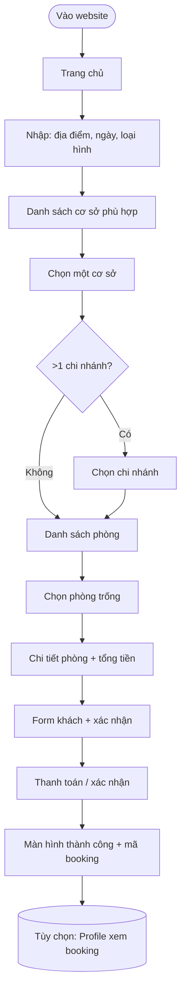
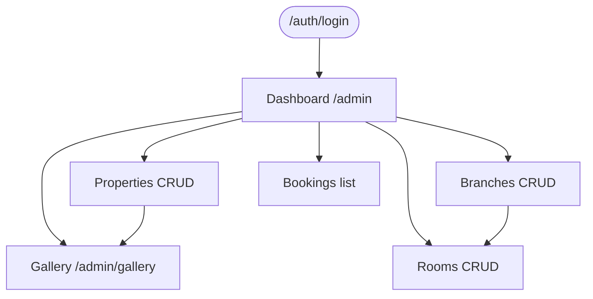

# 01 — User Flows

Mô tả luồng hành vi **trước khi** thiết kế chi tiết UI/API. URL và tên màn có thể đổi — **thứ tự bước** là cố định.

---

## 1. Luồng khách — Đặt phòng (happy path)



### 1.1 Bước chi tiết

| Bước | Màn hình (web) | Hành động khách | Dữ liệu cần |
|------|----------------|-----------------|-------------|
| 1 | `/` | Xem hero, khu vực phổ biến | — |
| 2 | `/` hoặc `/booking` | Submit form tìm kiếm | `city`, `checkIn`, `checkOut`, `kind` |
| 3 | `/booking` | Duyệt thẻ cơ sở | API list properties |
| 4 | `/booking?property=slug` | Xem thông tin, chọn tiếp | API property by slug |
| 5 | `/booking?property&branch` | Chọn chi nhánh (nếu nhiều) | branches trong property |
| 6 | `/booking?property&branch` | Lọc phòng, xem trạng thái | API list rooms |
| 7 | `/room/:slug` | Xem ảnh, mô tả, giá theo đêm | room detail |
| 8 | `/checkout` | Nhập tên, SĐT, email, ghi chú | form + context URL |
| 9 | `/checkout` | Xác nhận → tạo booking | POST booking |
| 10 | Success / `/profile` | Lưu mã booking | GET bookings (P1) |

### 1.2 Query params chuẩn (booking context)

Giữ xuyên suốt luồng (đã dùng trên frontend):

| Param | Ý nghĩa | Ví dụ |
|-------|---------|-------|
| `city` | Lọc địa điểm | `Đà Lạt` |
| `checkIn` | Ngày nhận | `2026-07-01` |
| `checkOut` | Ngày trả | `2026-07-03` |
| `kind` | Loại hình | `homestay` |
| `property` | Slug cơ sở | `cherry-house-da-lat` |
| `branch` | Mã chi nhánh | `dl-hxh` |

---

## 2. Luồng khách — Nhánh phụ

### 2.1 Không tìm thấy cơ sở

```
Search → List rỗng → Gợi ý đổi địa điểm / xóa bộ lọc
```

### 2.2 Phòng không còn trống

```
Rooms → Chỉ hiện available; booked/pending disabled hoặc ẩn
```

### 2.3 Checkout thất bại

```
POST booking lỗi (trùng ngày / hết hạn hold) → Thông báo → quay lại danh sách phòng
```

### 2.4 Khách chưa đăng nhập (MVP)

```
Checkout cho phép guest → booking `userId = null`, bắt buộc email + phone
```

---

## 3. Luồng admin



### 3.1 Catalog setup (thứ tự vận hành đề xuất)

1. Tạo **Property** (cơ sở).
2. Gán **ảnh** (hero, gallery) — từ media library hoặc URL.
3. Tạo **Branch** (chi nhánh) + map pin (tùy chọn).
4. Tạo **RoomType** (mẫu phòng) nếu dùng.
5. Tạo **InventoryRoom** (phòng vật lý, mã, giá, trạng thái).

### 3.2 Media library

```
Upload ảnh → folder → copy path → dán vào form property/room
```

(Sau này: modal chọn ảnh từ gallery trong form admin.)

---

## 4. Luồng mobile (Flutter — định hướng)

Giống web, rút gọn navigation:

```
Home → Booking (list) → Property detail → Branch → Rooms → Room detail → Checkout
```

Tab: Trang chủ | Đặt phòng | Tài khoản.

Hiện tại: **fake data** — phase sau map 1:1 API catalog.

---

## 5. Ma trận màn ↔ API (tham chiếu)

| Bước flow | API chính |
|-----------|-----------|
| List cơ sở | `GET /api/catalog/properties` |
| Chi tiết cơ sở | `GET /api/catalog/properties/slug/:slug` |
| Danh sách phòng | `GET /api/catalog/rooms?propertySlug&branchCode` |
| Chi tiết phòng | `GET /api/catalog/rooms/:id` |
| Tạo booking | `POST /api/bookings` |
| Thanh toán | `POST /api/payments` |

Chi tiết → [03-erd-api.md](./03-erd-api.md).

---

## 6. Wireframe checklist (chưa vẽ — cần bổ sung)

- [ ] Trang chủ (hero + search)
- [ ] Danh sách cơ sở
- [ ] Chọn chi nhánh
- [ ] Danh sách phòng + filter trạng thái
- [ ] Chi tiết phòng (sticky CTA)
- [ ] Checkout
- [ ] Admin: form property / branch / room
- [ ] Admin: gallery

*Có thể thêm link Figma vào đây khi có.*
