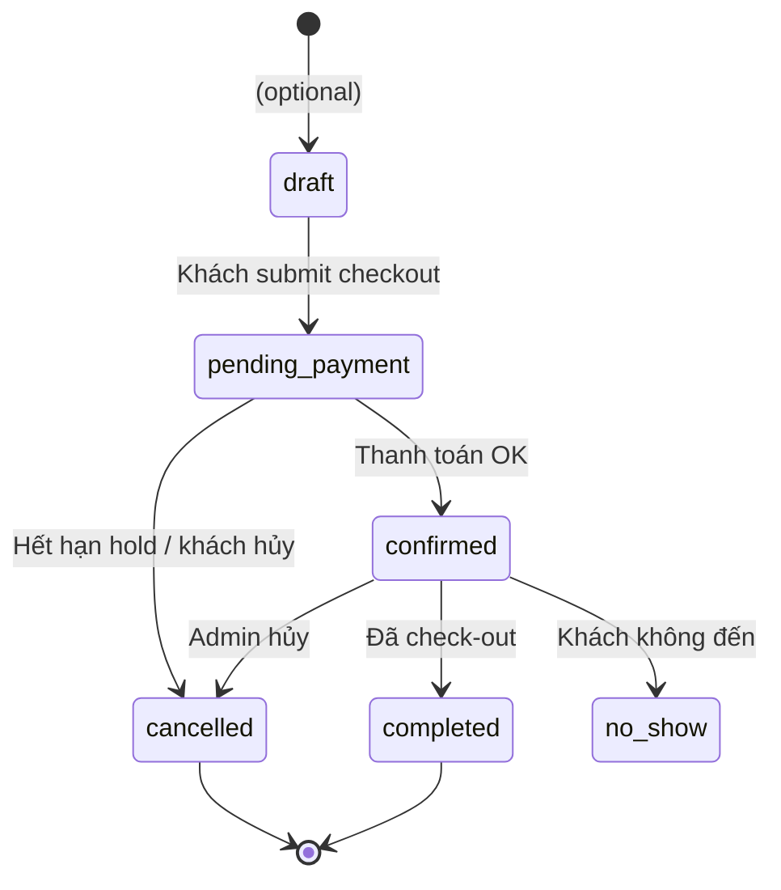

# 02 — Domain Rules (Quy tắc nghiệp vụ)

Tài liệu **bắt buộc đọc** trước khi implement booking, pricing, trạng thái phòng.  
Các mục `[CHỐT]` = chưa xác nhận chính thức — ghi đáp án khi đã quyết.

---

## 1. Thuật ngữ

| Thuật ngữ | Định nghĩa |
|-----------|------------|
| **Property** | Cơ sở lưu trú theo địa điểm / marketing (slug, city) |
| **Branch** | Chi nhánh vật lý thuộc một property (`code` duy nhất trong property) |
| **RoomType** | Mẫu / loại phòng (Standard, Deluxe…) — mô tả, diện tích |
| **InventoryRoom** | Phòng vật lý có mã (`HXH-101`), giá, trạng thái |
| **Booking** | Giao dịch đặt một phòng trong khoảng `[checkIn, checkOut)` |
| **Night** | `checkOut - checkIn` (ngày lịch, tối thiểu 1) |

---

## 2. Quy tắc catalog

### DR-01 — Một property thuộc một city

- `Property.city` dùng để **lọc tìm kiếm** (exact match hoặc normalize không dấu — `[CHỐT]`).
- Property có `isActive = false` → **không** hiện trên catalog public.

### DR-02 — Branch code

- Unique trong phạm vi `(propertyId, code)`.
- `code` dùng trong URL/API client (vd: `dl-hxh`), không dùng DB id trên frontend.

### DR-03 — RoomType vs InventoryRoom

- **Giá bán** trên MVP: lấy từ `InventoryRoom.priceVnd` `[CHỐT — đã gợi ý trong brief]`.
- RoomType cung cấp: category, capacity label, mô tả chung.

### DR-04 — Gallery & ảnh

- Ảnh property: `PropertyGallery` hoặc `heroImageUrl`.
- Ảnh phòng: `InventoryRoom.imageUrl`.
- Media library admin: file disk + `MediaImage.path` — dùng chung cho mọi entity.

---

## 3. Quy tắc tìm kiếm & availability

### DR-10 — Tham số tìm kiếm

| Param | Bắt buộc MVP | Ghi chú |
|-------|---------------|---------|
| `city` | Không | Lọc danh sách property |
| `checkIn`, `checkOut` | Không (UI có) | **P1:** lọc phòng trống theo ngày |
| `kind` | Không | homestay, mini_hotel, villa, serviced_apartment |

### DR-11 — Trùng booking (critical)

**Không** cho phép hai booking **active** cùng `roomId` có khoảng ngày overlap.

Booking **active** = status ∈ `{ pending_payment, confirmed }` `[CHỐT]`.

```
Overlap nếu: existing.checkIn < new.checkOut AND existing.checkOut > new.checkIn
```

Kiểm tra **bắt buộc trên server** khi `POST /bookings` (transaction).

### DR-12 — Trạng thái phòng (inventory)

| Status | Ý nghĩa UI | Ai đổi |
|--------|------------|--------|
| `available` | Có thể đặt | Hệ thống / admin |
| `pending` | Đang giữ (checkout) | Hệ thống |
| `booked` | Đã có booking confirmed | Hệ thống |

`InventoryRoom.status` là **view nhanh** — nguồn sự thật cuối cùng vẫn là bảng `bookings` `[CHỐT]`.

---

## 4. Quy tắc booking

### DR-20 — Vòng đời booking



### DR-21 — Hold phòng (pending_payment)

- Khi tạo booking: `status = pending_payment`, set `holdExpiresAt = now + 15 phút` `[CHỐT]`.
- Job / cron (phase sau) hoặc check khi booking mới → cancel expired holds.

### DR-22 — Mã booking

- `bookingCode` unique, human-readable: vd `CH-20260701-XXXX` `[CHỐT format]`.

### DR-23 — Guest không đăng nhập

- `userId` nullable.
- Bắt buộc: `guestName`, `guestPhone`, `guestEmail`.

### DR-24 — Snapshot trên booking

Lưu **ảnh chụp** tại thời điểm đặt (denormalized):

- `propertyName`, `branchName`, `roomCode`, `pricePerNightVnd`, `totalVnd`  
→ Tránh đổi giá sau này làm sai lịch sử.

---

## 5. Quy tắc giá & thanh toán

### DR-30 — Tính tiền

```
nights = max(1, days between checkIn and checkOut)
subtotalVnd = pricePerNightVnd * nights
serviceFeeVnd = [CHỐT: 0 hoặc %]
discountVnd = promo (nếu có)
totalVnd = subtotalVnd + serviceFeeVnd - discountVnd
```

### DR-31 — Promo code (P2)

- `PromoCode`: percent, validFrom/To, maxUses.
- Áp dụng tại checkout — validate server.

### DR-32 — Payment MVP

| Giai đoạn | Hành vi |
|-----------|---------|
| MVP | `POST /payments` → `status = paid` giả lập |
| Production | Tích hợp gateway → webhook cập nhật `paid` |

Booking chỉ `confirmed` khi `Payment.status = paid` `[CHỐT]`.

---

## 6. Quy tắc admin & quyền

### DR-40 — Role

| Role | Quyền |
|------|-------|
| `user` | Catalog public, booking (P1: profile) |
| `admin` | CRUD catalog, xem booking, gallery |
| `super_admin` | + quản lý user `[CHỐT]` |

### DR-41 — Soft delete

- MVP: `isActive = false` thay vì xóa cứng property/branch/room có booking lịch sử.

---

## 7. Quy tắc API / integration

### DR-50 — Response format

```json
{ "success": true, "data": { } }
{ "success": false, "message": "...", "code": "DB_UNAVAILABLE" }
```

### DR-51 — Catalog vs CRUD

- React khách **chỉ** đọc `/api/catalog/*`.
- Admin form / tool có thể dùng `/api/*` CRUD (cần auth `[CHỐT]`).

### DR-52 — Không mock ở luồng P0

Sau Phase 1, các bước sau **bắt buộc** gọi API:

- Danh sách cơ sở, chi tiết, phòng, tạo booking.

---

## 8. Bảng quyết định đã chốt

| ID | Quyết định | Ngày | Người chốt |
|----|------------|------|------------|
| — | *(điền khi họp)* | | |

---

## 9. Liên kết

- ERD & API → [03-erd-api.md](./03-erd-api.md)
- Backlog implement rules → [04-roadmap-backlog.md](./04-roadmap-backlog.md)
