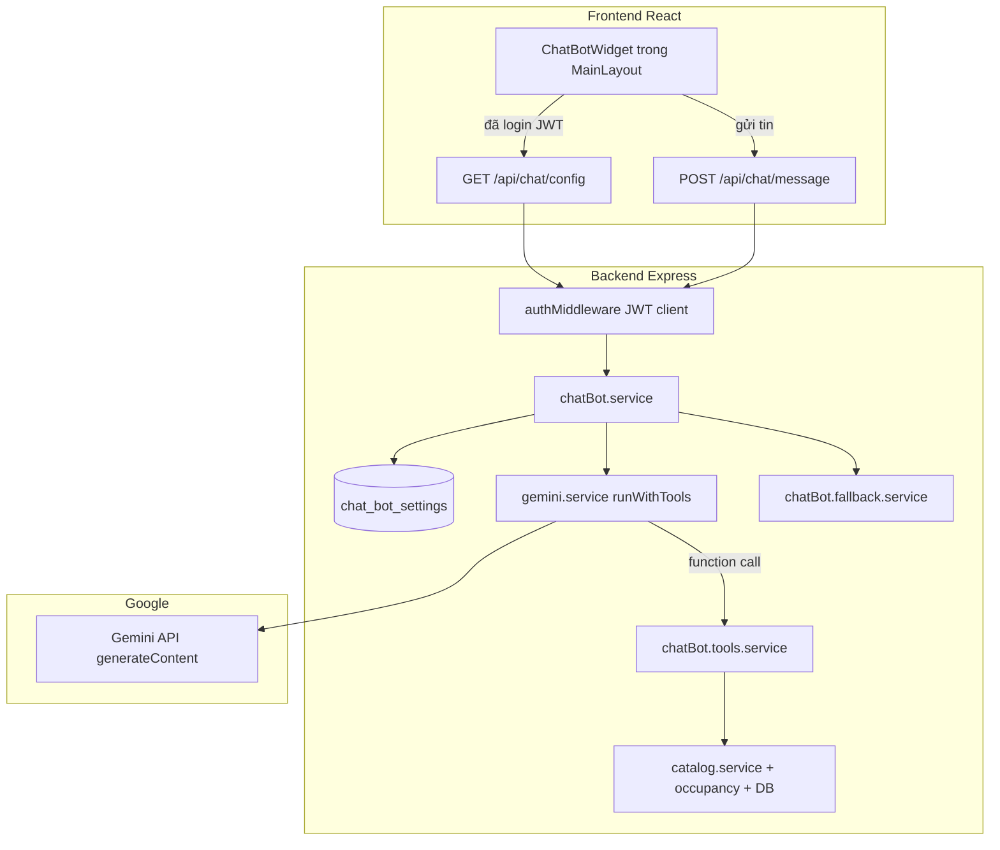

# 06 — Chatbot AI (flow & kiến trúc)

Trợ lý **Cherry Assistant** trên website: Gemini + function calling, dữ liệu phòng/giá từ catalog & booking thật.

---

## 1. Kiến trúc tổng thể



---

## 2. Frontend

| File | Vai trò |
|------|---------|
| `frontend/src/layouts/MainLayout.jsx` | Gắn `<ChatBotWidget />` trên mọi trang client |
| `frontend/src/components/chat/ChatBotWidget.jsx` | UI bubble, panel chat, gợi ý câu hỏi |
| `frontend/src/api/chatApi.js` | `fetchChatConfig()`, `sendChatMessage()` |

### Luồng UI

1. **Chưa đăng nhập** → hiện `ChatLoginGate` (yêu cầu login/register).
2. **Đã login** → `GET /api/chat/config` lấy `assistantName`, `welcomeMessage`, `isEnabled`.
3. User gửi tin → `POST /api/chat/message` với `message` + `history` (tối đa ~10 tin gần nhất trong state React; **không** lưu DB).
4. Reply hiển thị text; URL nội bộ (`/booking`, `/room/`, `/properties`) render thành React `Link`.

---

## 3. API

| Method | Path | Auth | Body / Response |
|--------|------|------|-----------------|
| `GET` | `/api/chat/config` | JWT client (`Bearer`) | → `{ assistantName, welcomeMessage, isEnabled }` |
| `POST` | `/api/chat/message` | JWT client | Body: `{ message, history? }` → `{ reply, toolsUsed }` |

- Route: `backend/src/routes/chatBot.route.js`
- Controller: `backend/src/controllers/chatBot.controller.js`
- Middleware: `backend/src/middleware/auth.middleware.js` — từ chối token admin (`403 WRONG_TOKEN_TYPE`).

---

## 4. Xử lý một tin nhắn (backend)

```
sendMessage (controller)
  → chat() (chatBot.service)
      ① assertGeminiConfigured() — GOOGLE_AI_STUDIO_API_KEY
      ② chatBotConfigService.getPublicConfig() — isEnabled
      ③ getResolvedSystemPrompt() — DB + thay {{today}}, {{cities}}, {{assistantName}}
      ④ gemini.service.runWithTools()
      ⑤ needsSmartFallback(reply) → buildSmartFallbackReply() nếu cần
      ⑥ return { reply, toolsUsed }
```

### Vòng lặp Gemini (`runWithTools`, tối đa 6 round)

1. Gửi `systemInstruction` + `contents` + `functionDeclarations`.
2. Model trả **text** → kết thúc, trả `reply`.
3. Model gọi **function** → `executeTool(name, args)` → đẩy `functionResponse` vào conversation → gọi lại Gemini.

File: `backend/src/services/gemini.service.js`

---

## 5. Tools (dữ liệu thật)

Định nghĩa: `backend/src/services/chatBot.service.js` (`TOOL_DECLARATIONS`)  
Thực thi: `backend/src/services/chatBot.tools.service.js` (`executeTool`)

| Tool | Mục đích | Nguồn |
|------|----------|--------|
| `list_properties` | Danh sách cơ sở theo thành phố / loại hình | `catalog.service` (`isActive: true`) |
| `get_property_detail` | Chi tiết cơ sở theo `slug` | Catalog |
| `search_available_rooms` | Phòng trống hoặc giá tham khảo theo ngày, ngân sách | Catalog + `getBranchOccupancy` |
| `get_branch_room_status` | Trạng thái từng phòng tại một chi nhánh | Occupancy |
| `get_room_quote` | Giá + trạng thái một mã phòng (kể cả đã đặt/giữ) | Catalog + occupancy |

Mỗi phòng có thể kèm **`bookingUrl`** (deep link web đặt phòng).

### Lỗi nghiệp vụ tool trả về

| `error` | Ý nghĩa |
|---------|---------|
| `property_inactive` / `branch_inactive` / `room_inactive` | Tạm ngừng HĐ — không nhận đặt mới |
| `city_inactive_only` | Thành phố chỉ còn cơ sở ngừng HĐ |
| `city_not_supported` | Không map được thành phố trong `SUPPORTED_CITIES` |
| `room_not_found` / `ambiguous_room` | Không tìm thấy / trùng mã nhiều chi nhánh |
| `invalid_dates` | Ngày trả ≤ ngày nhận |

---

## 6. System prompt & cấu hình admin

- Bảng: `chat_bot_settings` (singleton `id = 1`)
- Admin: **`/admin/chatbot`**
- Service: `backend/src/services/chatBotConfig.service.js`

### Placeholder trong prompt

| Biến | Nguồn |
|------|--------|
| `{{today}}` | Ngày hiện tại `YYYY-MM-DD` |
| `{{assistantName}}` | Tên bot từ DB |
| `{{cities}}` | `SUPPORTED_CITIES` trong `chatBot.tools.service.js` (danh sách marketing, **chưa** sync DB) |

### Quy tắc prompt mặc định (tóm tắt)

- Chỉ trả lời lưu trú Cherry House; chào hỏi **không** gọi tool.
- Có số liệu phòng/giá → **bắt buộc gọi tool**, không bịa.
- Parse ngày tiếng Việt (`12-8`, `tháng 8`, …).
- Hỏi mã phòng cụ thể → `get_room_quote` / `get_branch_room_status`, không chỉ `search_available_rooms`.
- Giải thích ngừng HĐ theo `property_inactive` / `branch_inactive` / `room_inactive`.

> **Lưu ý:** Prompt cũ trong DB admin cần **Reset / cập nhật** tại `/admin/chatbot` sau khi đổi default prompt trong code.

---

## 7. Smart fallback

Khi Gemini trả rỗng hoặc câu generic *"Xin lỗi, tôi chưa trả lời được"*:

`backend/src/services/chatBot.fallback.service.js`

- Parse mã phòng, ngày từ câu user.
- Đọc lại `toolsUsed` vừa chạy.
- Ghép reply có cấu trúc: giá, trạng thái (`available` / `booked` / `inactive`), link đặt phòng.

---

## 8. Biến môi trường

| Biến | Mô tả |
|------|--------|
| `GOOGLE_AI_STUDIO_API_KEY` | API key Gemini (**bắt buộc**) |
| `GOOGLE_AI_MODEL` | Model chính (mặc định `gemini-2.5-flash-lite`) |
| `GOOGLE_AI_MODEL_FALLBACK` | Danh sách model dự phòng (CSV), khi quota / 429 |

Config: `backend/src/config/gemini.config.js`

Gemini service: thử nhiều model, retry ngắt khi rate limit, message lỗi thân thiện (quota, API key).

---

## 9. Điều kiện hoạt động (checklist)

1. User **đã đăng nhập** (JWT client).
2. Admin bật chatbot tại `/admin/chatbot` (`isEnabled = true`).
3. `.env` có `GOOGLE_AI_STUDIO_API_KEY`.
4. MySQL chạy (tools đọc catalog / booking).
5. Gemini còn quota (free tier có giới hạn theo model).

---

## 10. File map (tham khảo nhanh)

```
backend/src/
  routes/chatBot.route.js
  controllers/chatBot.controller.js
  controllers/adminChatBot.controller.js
  services/chatBot.service.js
  services/chatBot.tools.service.js
  services/chatBotConfig.service.js
  services/chatBot.fallback.service.js
  services/gemini.service.js
  config/gemini.config.js
  repositories/chatBotConfig.repository.js
  views/admin/chatbot/index.ejs

frontend/src/
  components/chat/ChatBotWidget.jsx
  api/chatApi.js
```

---

## 11. Hạn chế / việc cần cải thiện

| Vấn đề | Mô tả |
|--------|--------|
| `{{cities}}` hardcode | `SUPPORTED_CITIES` (10 thành phố marketing) — bot có thể trả danh sách sai nếu **không** gọi `list_properties` |
| Chỉ member | API chat yêu cầu JWT — khách chưa login chỉ thấy màn hình đăng nhập |
| Không lưu lịch sử chat | `history` chỉ trong session trình duyệt |
| Mobile | Chưa có widget chatbot tương đương |
