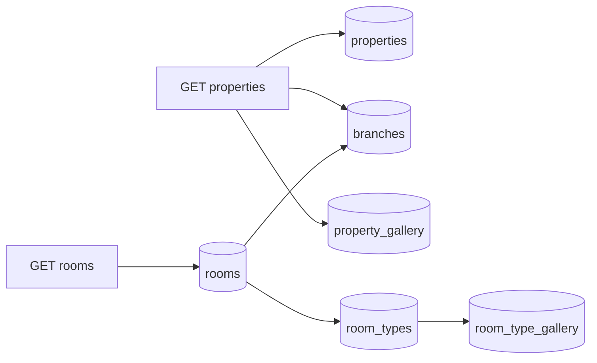
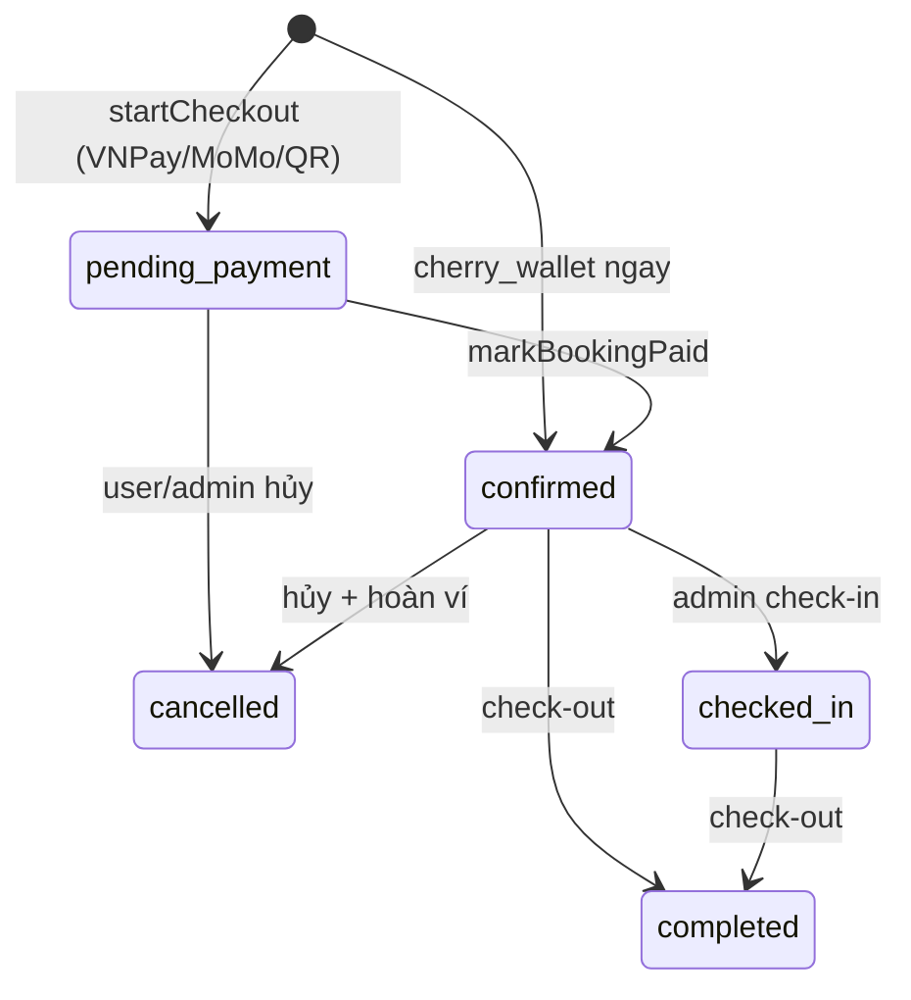
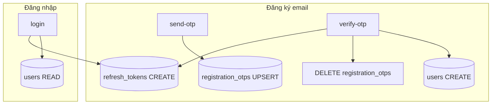

# 07 — Luồng tính năng bên ngoài → Database

Tài liệu mô tả **mọi tương tác DB** từ kênh bên ngoài (React SPA, mobile, webhook cổng thanh toán, admin SSR) tới MySQL qua Prisma.

**Nguồn schema:** `backend/prisma/schema.prisma`  
**Đối chiếu:** [01-user-flows](./01-user-flows.md), [02-domain-rules](./02-domain-rules.md), [03-erd-api](./03-erd-api.md), [06-chatbot-flow](./06-chatbot-flow.md)

---

## 1. Danh sách bảng (33 bảng)

| # | Bảng Prisma | Vai trò |
|---|-------------|---------|
| 1 | `properties` | Cơ sở lưu trú |
| 2 | `property_gallery` | Ảnh gallery cơ sở |
| 3 | `branches` | Chi nhánh |
| 4 | `branch_map_pins` | Tọa độ bản đồ chi nhánh |
| 5 | `room_types` | Mẫu / loại phòng |
| 6 | `room_type_gallery` | Ảnh loại phòng |
| 7 | `amenities` | Danh mục tiện nghi |
| 8 | `property_amenities` | N-N property ↔ amenity |
| 9 | `room_type_amenities` | N-N room_type ↔ amenity |
| 10 | `rooms` | Phòng vật lý (inventory) |
| 11 | `users` | Khách (React / mobile) |
| 12 | `admins` | Quản trị / lễ tân |
| 13 | `refresh_tokens` | Refresh token client & admin |
| 14 | `registration_otps` | OTP đăng ký email (tạm) |
| 15 | `email_change_otps` | OTP đổi email |
| 16 | `password_reset_otps` | OTP quên mật khẩu |
| 17 | `bookings` | Đặt phòng |
| 18 | `payments` | Thanh toán (1-1 booking) |
| 19 | `user_wallets` | Số dư ví nội bộ |
| 20 | `wallet_transactions` | Sổ cái ví (bất biến) |
| 21 | `booking_refunds` | Audit hủy / hoàn tiền |
| 22 | `booking_check_ins` | Chữ ký & thời điểm check-in |
| 23 | `media_folders` | Thư mục media admin |
| 24 | `media_images` | File ảnh admin |
| 25 | `seo_global_settings` | SEO toàn site (singleton) |
| 26 | `seo_page_templates` | SEO theo `pageKey` |
| 27 | `home_hero_settings` | Banner trang chủ (singleton) |
| 28 | `home_page_settings` | Section homepage (singleton) |
| 29 | `chat_bot_settings` | Prompt chatbot (singleton) |
| 30 | `email_templates` | Mẫu email admin |
| 31 | `promo_codes` | Mã giảm giá |
| 32 | `promo_popup_settings` | Popup voucher web (singleton) |
| 33 | `contact_messages` | Form liên hệ |

---

## 2. Sơ đồ tổng quan

```mermaid
flowchart TB
  subgraph clients [Kênh bên ngoài]
    Web[React SPA]
    Mobile[Flutter mobile]
    Admin[Admin SSR /admin]
    GW[VNPay / MoMo IPN]
  end

  subgraph api [Express /api]
    Catalog[/catalog READ]
    Auth[/auth]
    Booking[/bookings]
    Checkout[/checkout]
    Wallet[/wallet]
    Chat[/chat]
    Contact[/contact]
    Public[/home seo geo promo-popup]
  end

  subgraph db [MySQL]
    Cat[(Catalog tables)]
    User[(users + OTP + refresh_tokens)]
    Book[(bookings + payments + refunds)]
    WalletT[(user_wallets + wallet_transactions)]
    CMS[(home seo chat promo contact)]
  end

  Web --> api
  Mobile --> api
  Admin --> db
  GW --> Checkout

  Catalog --> Cat
  Auth --> User
  Booking --> Book
  Checkout --> Book
  Checkout --> WalletT
  Wallet --> WalletT
  Chat --> Cat
  Chat --> Book
  Contact --> CMS
  Public --> CMS
  Public --> Cat
```

**Quy ước ký hiệu thao tác**

| Ký hiệu | Ý nghĩa |
|---------|---------|
| **R** | SELECT / đọc |
| **C** | INSERT |
| **U** | UPDATE |
| **D** | DELETE |
| **—** | Không chạm DB (file tĩnh / logic thuần) |

---

## 3. Health & Geo

### 3.1 `GET /api/health`

| Bảng | Thao tác | Ghi chú |
|------|----------|---------|
| *(bất kỳ)* | **R** `SELECT 1` | Kiểm tra kết nối MySQL |

| Case | Kết quả |
|------|---------|
| DB OK | `200`, `database: connected` |
| DB lỗi | `503`, `code: DB_UNAVAILABLE` |

### 3.2 `GET /api/geo/*`

| Endpoint | Bảng | Thao tác |
|----------|------|----------|
| `/provinces`, `/destinations`, `/property-cities` | — | **—** Đọc `vietnam-provinces.js` (static) |
| `/catalog-cities` | `properties` | **R** `distinct city` where `isActive=true`; fallback static nếu DB rỗng |

---

## 4. Trang chủ, SEO, Popup voucher (public READ)

### 4.1 Home

| API | Bảng | Thao tác |
|-----|------|----------|
| `GET /api/home/hero` | `home_hero_settings` | **R** id=1 |
| `GET /api/home/sections` | `home_page_settings` | **R** id=1 |

| Case | Hành vi |
|------|---------|
| Chưa seed | Fallback default trên frontend |
| `isEnabled=false` (hero) | Frontend ẩn / dùng default |

### 4.2 SEO (React)

| API | Bảng | Thao tác |
|-----|------|----------|
| `GET /api/seo/global` | `seo_global_settings` | **R** |
| `GET /api/seo/pages/:pageKey` | `seo_page_templates` | **R** theo `pageKey` |

### 4.3 Promo popup

| API | Bảng | Thao tác |
|-----|------|----------|
| `GET /api/promo-popup` | `promo_popup_settings` | **R** id=1 |
| | `promo_codes` | **R** join khi `promoCodeId` hoặc auto-select |

| Case | Response |
|------|----------|
| `isEnabled=false` | Popup tắt |
| Không có mã hợp lệ | `enabled: false` |
| Mã hết hạn / hết lượt | Không trả mã |

### 4.4 Promo validate (checkout)

| API | Bảng | Thao tác |
|-----|------|----------|
| `POST /api/promo-codes/validate` | `promo_codes` | **R** theo `code` |

| Case | Kết quả |
|------|---------|
| Không tồn tại | 400 |
| `!isActive` | 400 |
| Ngoài `validFrom`–`validTo` | 400 |
| `usedCount >= maxUses` | 400 |
| `subtotal < minSubtotalVnd` | 400 |
| Hợp lệ | Trả `discountVnd`, `totalVnd` (chưa ghi DB) |

**Ghi `used_count`:** chỉ khi thanh toán thành công (`markBookingPaid` hoặc ví Cherry) — **U** `promo_codes.used_count + 1`.

---

## 5. Catalog public (READ-only)

**Base:** `/api/catalog` — không auth; chỉ `isActive=true`.



| API | Bảng đọc |
|-----|----------|
| `GET /properties` | `properties`, `branches`, `property_gallery` |
| `GET /properties/slug/:slug` | + `property_amenities`→`amenities`, `branch_map_pins` |
| `GET /properties/:id/branches` | `branches` |
| `GET /branches`, `GET /branches/:id` | `branches`, `branch_map_pins` |
| `GET /rooms`, `GET /rooms/:id` | `rooms`, `branches`, `properties`, `room_types` |

| Case | Hành vi |
|------|---------|
| `isActive=false` | Không trả về catalog public |
| Lọc `province` / `city` / `kind` | WHERE trên `properties` |
| Phòng `status=booked` | Vẫn trả về; availability thật từ `bookings` |

**Không ghi DB** trên toàn bộ catalog public.

---

## 6. Tìm phòng & availability

### 6.1 Luồng UI (React)

```
Home/Booking search → catalog READ → chọn property/branch → rooms READ
→ POST check-availability → đọc bookings overlap
```

### 6.2 `POST /api/bookings/check-availability`

| Bước | Bảng | Thao tác |
|------|------|----------|
| Resolve phòng | `rooms`, `branches`, `properties` | **R** |
| Kiểm tra inventory | `rooms.status` | **R** |
| Overlap | `bookings` | **R** |

**Booking chiếm phòng** (`OCCUPYING_STATUSES`): `pending_payment` (hold còn hạn), `confirmed`, `checked_in`.

```text
Overlap: existing.checkIn < new.checkOut AND existing.checkOut > new.checkIn
pending_payment: chỉ tính nếu holdExpiresAt IS NULL hoặc holdExpiresAt > now()
```

| Case | `available` | `message` |
|------|-------------|-----------|
| `rooms.status = booked` | false | Phòng đánh dấu đã đặt |
| Có booking overlap | false | Đã có đặt trong khoảng ngày |
| Hold hết hạn (`pending_payment`) | true | Hold cũ bị bỏ qua |
| Phòng inactive | 404 / lỗi resolve | — |

### 6.3 `GET /api/bookings/occupancy` (admin optional)

| Bảng | Thao tác |
|------|----------|
| `bookings`, `rooms` | **R** theo `branchId` + khoảng ngày |

---

## 7. Checkout & thanh toán (luồng trọng tâm)

**Yêu cầu:** JWT client (`POST /api/checkout/pay`). Guest không login → **401** (đã chốt trong code hiện tại).



### 7.1 `POST /api/checkout/pay` — case chung

| Bước | Bảng | Thao tác |
|------|------|----------|
| Auth | `users` | **R** `getMe`, merge guest contact |
| Guard | `users` | **R** `bookingBanned`, `isActive` |
| Resolve phòng | `rooms`, `branches`, `properties`, `room_types` | **R** |
| Availability | `bookings` | **R** overlap |
| Pricing | `promo_codes` | **R** nếu có mã (validate) |
| Tạo đơn | `bookings` | **C** `status=pending_payment`, `holdExpiresAt=now+15m` |
| | `payments` | **C** `status=pending` |

| Case | HTTP | DB |
|------|------|-----|
| Chưa login | 401 | Không ghi |
| User bị `bookingBanned` | 403 | Không ghi |
| Phòng trùng ngày | 409 | Không ghi |
| Promo không hợp lệ | 400 | Không ghi |
| Thiếu guestName/Phone/Email | 400 | Không ghi |

### 7.2 Thanh toán VNPay / MoMo (`card`, `momo`, `wallet`→QR)

Sau bước 7.1 → redirect cổng thanh toán (**không thêm ghi DB** cho đến callback).

| Sự kiện | API | Bảng | Thao tác |
|---------|-----|------|----------|
| Return URL | `GET /checkout/verify/vnpay` | `bookings` | **U** → `confirmed` |
| | | `payments` | **U** → `paid`, `paidAt` |
| | | `promo_codes` | **U** `used_count+1` nếu có mã |
| MoMo return | `GET /checkout/verify/momo` | *(tương tự)* | |
| VNPay IPN | `GET/POST /checkout/ipn/vnpay` | *(tương tự)* | |
| MoMo IPN | `POST /checkout/ipn/momo` | *(tương tự)* | |

| Case callback | Hành vi |
|---------------|---------|
| Đã `confirmed` | Idempotent — bỏ qua |
| Chữ ký sai | Không `markBookingPaid` |
| Thanh toán thất bại | Booking giữ `pending_payment` đến hết hold |
| Email xác nhận | Gửi async (không ghi DB) |

### 7.3 Ví Cherry House (`cherry_wallet`)

Một transaction:

| Bảng | Thao tác |
|------|----------|
| `bookings` | **C** `status=confirmed` (không hold) |
| `user_wallets` | **R/C** getOrCreate |
| `user_wallets` | **U** `balanceVnd -= total` |
| `wallet_transactions` | **C** `type=pay_booking`, `amountVnd` âm |
| `payments` | **C** `status=paid`, `method=cherry_wallet` |
| `promo_codes` | **U** `used_count+1` nếu có |

| Case | Kết quả |
|------|---------|
| Số dư không đủ | 400, rollback transaction |
| Promo race (hết lượt) | Booking vẫn tạo; warn log |

### 7.4 `GET /api/checkout/status/:bookingCode`

| Bảng | Thao tác |
|------|----------|
| `bookings`, `payments`, `rooms`, `properties`, `branches` | **R** |

### 7.5 Hold `pending_payment` (chưa có cron tự hủy)

| Trạng thái | Ảnh hưởng availability |
|------------|------------------------|
| `pending_payment` + `holdExpiresAt > now` | **Chặn** phòng |
| `pending_payment` + hold hết hạn | **Không chặn** (overlap query bỏ qua) |
| Booking record cũ | Vẫn tồn tại DB đến khi admin/user hủy |

> **Gap:** Chưa có job tự `cancel` booking hết hold — cần admin hoặc user hủy thủ công.

---

## 8. Profile — đơn của khách & hủy

### 8.1 `GET /api/bookings/me` (JWT)

| Bảng | Thao tác |
|------|----------|
| `bookings` | **R** `userId` HOẶC `guestEmail` = user.email |
| `payments`, `refunds`, `rooms`, `properties`, `branches` | **R** include |

| Filter | WHERE |
|--------|-------|
| `pending` | `status=pending_payment` |
| `upcoming` | `checkOut >= today`, not cancelled |
| `past` | cancelled OR `checkOut < today` |

### 8.2 Hủy booking — `GET cancel-preview`, `POST cancel`

| Bước | Bảng | Thao tác |
|------|------|----------|
| Quyền | `bookings` | **R** owner / email khớp |
| Preview | — | Tính policy từ `payment` + `checkIn` (không ghi) |
| Hủy | `bookings` | **U** `status=cancelled` |
| Đã trả tiền + đủ điều kiện hoàn | `user_wallets` | **U** cộng tiền |
| | `wallet_transactions` | **C** `type=refund` |
| | `payments` | **U** `refunded` |
| Chưa trả (`pending`) | `payments` | **U** `failed` |
| Audit | `booking_refunds` | **C** policy, %, amount |

| Case | `canCancel` | Hoàn ví |
|------|-------------|---------|
| `status` ∉ `confirmed`, `pending_payment` | false | — |
| Đã `cancelled` | false | — |
| `confirmed` + trả trước ≥24h check-in | true | 100% (policy) |
| Trong 24h | true | 0% |
| `pending_payment` chưa trả | true | 0% |
| Không có `userId` (guest cũ) | true nếu email khớp | Không credit ví (cần `userId`) |

---

## 9. Auth khách (React / mobile)

**Base:** `/api/auth`



### 9.1 Đăng ký OTP

| API | Bảng | Thao tác |
|-----|------|----------|
| `POST /register/send-otp` | `users` | **R** email trùng → 409 |
| | `admins` | **R** email trùng → 409 |
| | `registration_otps` | **C/U** upsert |
| `POST /register/verify-otp` | `registration_otps` | **R**, **D** sau success |
| | `users` | **C** `authProvider=local` |
| | `refresh_tokens` | **C** |

| Case | Kết quả |
|------|---------|
| OTP sai | **U** `attempts+1`; ≥5 lần → xóa record |
| OTP hết hạn | **D** record, 410 |
| Email đã tồn tại lúc verify | 409 |

### 9.2 Đăng nhập / refresh / logout

| API | Bảng | Thao tác |
|-----|------|----------|
| `POST /login` | `users` | **R** + verify password |
| | `admins` | **R** chặn email admin |
| | `refresh_tokens` | **C** |
| `POST /refresh` | `refresh_tokens` | **R/U** rotate |
| | `users` | **R** `isActive` |
| `POST /logout` | `refresh_tokens` | **U** `revokedAt` |

### 9.3 Google OAuth

| API | Bảng | Thao tác |
|-----|------|----------|
| `GET /google/callback` | `users` | **R** by `googleId` or `email` |
| | `users` | **C** hoặc **U** profile Google |
| | `refresh_tokens` | **C** |
| `POST /google/mobile` | *(tương tự)* | |

### 9.4 Profile

| API | Bảng | Thao tác |
|-----|------|----------|
| `GET /me` | `users` | **R** |
| `PATCH /me` | `users` | **U** `fullName`, `phone`, `profileMeta` (không đổi email) |
| `POST /change-password` | `users` | **U** `passwordHash` |
| `POST /change-email/request` | `email_change_otps` | **C/U** |
| | `users` | **R** verify password (local) |
| `POST /change-email/confirm` | `email_change_otps` | **R**, **D** |
| | `users` | **U** `email` |
| `POST /forgot-password/request` | `password_reset_otps` | **C/U** |
| `POST /forgot-password/confirm` | `password_reset_otps` | **R**, **D** |
| | `users` | **U** `passwordHash` |

| Case | Ghi chú |
|------|---------|
| Google user đổi email | Không cần mật khẩu cũ |
| Email mới trùng user/admin | 409 |
| OTP email change sai / hết hạn | Giống register OTP |

---

## 10. Ví Cherry House

| API | Bảng | Thao tác |
|-----|------|----------|
| `GET /api/wallet` | `user_wallets` | **R/C** lazy create |
| | `wallet_transactions` | **R** 10 giao dịch gần nhất |
| `GET /api/wallet/transactions` | `wallet_transactions` | **R** phân trang |

**Ghi từ luồng khác:**

| Nguồn | `wallet_transactions.type` |
|-------|---------------------------|
| Checkout ví | `pay_booking` (âm) |
| Hủy booking | `refund` (dương) |
| Admin adjust | `admin_adjust` |

| Admin | API | Bảng |
|-------|-----|------|
| Điều chỉnh số dư | `POST /admin/users/:id/wallet-adjust` | **U** `user_wallets`, **C** `wallet_transactions` |

---

## 11. Form liên hệ

| API | Bảng | Thao tác |
|-----|------|----------|
| `POST /api/contact` | `contact_messages` | **C** `status=new`, lưu IP/UA |

| Admin | Thao tác |
|-------|----------|
| List / detail | **R** |
| Update status, note | **U** |
| Delete | **D** |

**Không gửi email tự động** (chỉ lưu DB).

---

## 12. Chatbot AI

Yêu cầu JWT client. **Không lưu lịch sử chat vào DB.**

| API | Bảng | Thao tác |
|-----|------|----------|
| `GET /api/chat/config` | `chat_bot_settings` | **R** id=1 |
| `POST /api/chat/message` | `chat_bot_settings` | **R** system prompt |
| Tools | `properties`, `branches`, `rooms`, `room_types` | **R** catalog |
| | `bookings` | **R** occupancy / overlap |

| Tool | DB chính |
|------|----------|
| `list_properties` | `properties` (+ branches) |
| `get_property_detail` | property + gallery + amenities |
| `search_available_rooms` | rooms + bookings overlap |
| `get_branch_room_status` | bookings by branch |
| `get_room_quote` | room + bookings |

Chi tiết → [06-chatbot-flow.md](./06-chatbot-flow.md).

---

## 13. Admin panel (SSR `/admin`)

Admin thao tác trực tiếp repository/Prisma — không qua `/api/catalog`.

### 13.1 Catalog CRUD

| Module | Bảng chính | Thao tác |
|--------|------------|----------|
| Properties | `properties`, `property_gallery`, `property_amenities` | **C/R/U/D**, deactivate=`isActive` |
| Branches | `branches`, `branch_map_pins` | **C/R/U/D** |
| Room types | `room_types`, `room_type_gallery`, `room_type_amenities` | **C/R/U/D** |
| Rooms | `rooms` | **C/R/U/D**, `status`, `priceVnd` |
| Amenities | `amenities` | **C/R/U/D** |
| Media | `media_folders`, `media_images` | **C/R/D** + file disk |

### 13.2 Booking vận hành

| Hành động | Route | Bảng | Thao tác |
|-----------|-------|------|----------|
| Tạo booking tay | `POST /admin/bookings` | `bookings`, `payments`? | **C** |
| Sửa booking | `POST /admin/bookings/:id` | `bookings` | **U** |
| Mark paid quầy | `POST .../mark-paid` | `bookings`, `payments` | **U** via `markBookingPaid` |
| Check-in | `POST .../check-in` | `bookings` | **U** → `checked_in` |
| | | `booking_check_ins` | **C** + file chữ ký disk |
| Check-out | `POST .../check-out` | `bookings` | **U** → `completed` |
| Hủy | `POST .../cancel` | `bookings`, `payments`, `booking_refunds`, wallet | Giống §8.2 `cancelledBy=admin` |
| Đổi status | `POST .../status` | `bookings` | **U** |

### 13.3 Users & tài khoản

| Hành động | Bảng |
|-----------|------|
| Sửa user, ban booking | `users` **U** (`bookingBanned`, `bookingBanReason`) |
| Xóa user | `users` **D** (cascade wallet, tokens…) |
| CRUD admin | `admins` **C/R/U** |

### 13.4 CMS & marketing

| Màn | Bảng |
|-----|------|
| `/admin/seo` | `seo_global_settings`, `seo_page_templates` |
| `/admin/home-hero`, home sections | `home_hero_settings`, `home_page_settings` |
| `/admin/chatbot` | `chat_bot_settings` |
| `/admin/promo-codes` | `promo_codes` |
| `/admin/promo-popup` | `promo_popup_settings` |
| Email templates | `email_templates` |

### 13.5 Auth admin

| Hành động | Bảng |
|-----------|------|
| Login `/auth/login` (admin) | `admins` **R**, `refresh_tokens` **C** |
| Staff scope | `admins.branchId`, `propertyId` filter booking |

---

## 14. Ma trận tính năng → bảng (tóm tắt)

| Tính năng | Đọc | Ghi |
|-----------|-----|-----|
| Tìm kiếm / catalog | properties, branches, rooms, room_types, … | — |
| Check availability | bookings, rooms | — |
| Checkout VNPay/MoMo | users, rooms, bookings, payments, promo_codes | bookings, payments; U khi paid |
| Checkout ví | + user_wallets, wallet_transactions | + wallet debit |
| Profile bookings | bookings (+ joins) | — |
| Hủy đơn | bookings, payments | bookings, payments, booking_refunds, wallet |
| Đăng ký / login | users, OTP tables, refresh_tokens | users, tokens |
| Ví | user_wallets, wallet_transactions | lazy create wallet |
| Contact | — | contact_messages |
| Chatbot | catalog + bookings, chat_bot_settings | — |
| Home / SEO / popup | CMS singletons, promo_codes | — |
| Admin CRUD | Tất cả catalog + CMS | C/U/D tương ứng |

---

## 15. Edge cases xuyên tính năng

| # | Tình huống | Hành vi hệ thống |
|---|------------|------------------|
| E1 | Hai khách cùng đặt 1 phòng 1 ngày | Transaction + overlap check → 409 người sau |
| E2 | `pending_payment` hết 15 phút | Không còn chặn availability; record vẫn DB |
| E3 | Callback VNPay/MoMo trùng | `markBookingPaid` idempotent nếu đã `confirmed` |
| E4 | Promo hết lượt lúc thanh toán | `used_count` UPDATE 0 rows → warn, booking vẫn confirm |
| E5 | User `bookingBanned` | Chặn ở checkout & `POST /bookings` |
| E6 | Đổi giá phòng sau khi đặt | Booking giữ snapshot `pricePerNightVnd`, `totalVnd` |
| E7 | Guest booking gắn `userId` sau login | `GET /me` vẫn tìm theo email khách |
| E8 | Admin deactivate property | Catalog public không trả; booking cũ giữ nguyên |
| E9 | Check-in không chữ ký | 400, không ghi `booking_check_ins` |
| E10 | Chatbot hallucinate thành phố | Chỉ marketing prompt; data thật từ tools |

---

## 16. Liên kết

- Luồng UX → [01-user-flows.md](./01-user-flows.md)
- Quy tắc overlap, hold, refund → [02-domain-rules.md](./02-domain-rules.md)
- Contract API → [03-erd-api.md](./03-erd-api.md)
- Chatbot → [06-chatbot-flow.md](./06-chatbot-flow.md)
